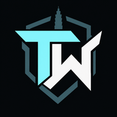

<div align="center">



# 角頭械鬥 · Turf War: Taipei

**A round-based SWAT vs Militia shooter set in the streets of Taipei — free in your browser, nothing to install.**

[](https://turfwar.ianhsiao.me)
[](https://github.com/madeyexz/turfwar/actions/workflows/ci.yml)
[](LICENSE)
[](CONTRIBUTING.md)
<br>
[](https://www.typescriptlang.org)
[](https://threejs.org)
[](https://spacetimedb.com)
[](https://bun.sh)

[**Play**](https://turfwar.ianhsiao.me) · [Trailer](https://turfwar.ianhsiao.me/media/turfwar-trailer-30s.mp4) · [中文預告片](https://turfwar.ianhsiao.me/media/turfwar-trailer-30s.zh-TW.mp4) · [Gameplay guide](docs/GAMEPLAY.md) · [Contributing](CONTRIBUTING.md)

<a href="https://turfwar.ianhsiao.me/media/turfwar-trailer-30s.mp4"></a>

<sub>Click the preview to watch the 30-second trailer.</sub>

</div>

## Contents

- [About](#about)
- [Features](#features)
- [Screenshots](#screenshots)
- [Getting started](#getting-started)
- [Project structure](#project-structure)
- [How it works](#how-it-works)
- [Roadmap](#roadmap)
- [Contributing](#contributing)
- [Security and privacy](#security-and-privacy)
- [Support the project](#support-the-project)
- [Acknowledgements](#acknowledgements)
- [License](#license)

## About

Turf War: Taipei is an open-source, browser-first team shooter. Two teams of up to 24 fight short,
one-life rounds across Taipei — Ximending's neon streets, an office floor 383 m up Taipei 101, the
Chiang Kai-shek Memorial Hall — with cash, a store and weapon attachments in the spirit of the classic
browser shooter *BeGone*. It runs on TypeScript and Three.js in the browser and a server-authoritative
[SpacetimeDB](https://spacetimedb.com) module online, with the same simulation powering offline play.

## Features

**Gameplay**

- **Two modes:** *Elimination* and *Sabotage* (Militia arms the bomb at site A or B; SWAT defends or
  disarms). First to 10 rounds, one life per round, a 4 s freeze and 20 s of buy time.
- **Twelve maps:** Ximending (西門町), Taipei 101 · Xinyi, Taipei 101 · 88F with its tuned mass damper,
  Memorial Hall (中正紀念堂), homages to BeGone's maps and original battlefields — see [Maps](docs/GAMEPLAY.md#maps).
- **Vehicles:** cars and taxis with handbrake drifts, scooters you can shoot from, and a helicopter.
- **Economy:** cash for kills, headshots, assists and objectives; five primaries, two secondaries,
  grenades, and optics, suppressors, lasers and more ([weapons](docs/GAMEPLAY.md#weapons)).

**Multiplayer**

- **Rooms of every size:** 1v1, 6v6 and 24v24. *Quick play* joins the fullest open room, *Start a server*
  opens a public room or a private one with a 4-letter code, and *Join a server* lists every live room with its ping.
- **Bots fill empty slots,** online and offline, at three difficulties.
- **Server-authoritative:** damage, cash, purchases, rounds and the bomb run on the server; movement is
  client-predicted and server-validated.

**Accessibility and platforms**

- **English and 繁體中文**, switchable at any time.
- **Rebindable controls** for every action, using physical key positions (AZERTY and Dvorak work).
- **Phones and tablets:** touch controls with an editable layout, hold-to-aim firing, and an
  installable app (PWA) — see [Phones and tablets](docs/GAMEPLAY.md#phones-tablets-and-the-installable-app).
- **Solo and practice** need no server at all.

## Screenshots

<table>
  <tr>
    <td width="50%"><br><sub><b>Taipei 101 · 88F</b>: the damper hall in the tower's core</sub></td>
    <td width="50%"><br><sub><b>Ximending</b>: a firefight on Cinema Street (電影街)</sub></td>
  </tr>
  <tr>
    <td><br><sub><b>Memorial Hall</b> (中正紀念堂): the grand staircase from Liberty Square</sub></td>
    <td><br><sub><b>Vehicles</b>: the helicopter over Ximending (cars and scooters too)</sub></td>
  </tr>
  <tr>
    <td><br><sub><b>Store</b>: weapons and attachments with BeGone's prices and stats</sub></td>
    <td><br><sub><b>Lobby</b>: Quick play, Start a server, Join a server</sub></td>
  </tr>
  <tr>
    <td><br><sub><b>繁體中文</b>: every screen in Traditional Chinese (炸彈已安裝)</sub></td>
    <td></td>
  </tr>
</table>

## Getting started

**Prerequisites:** [Bun 1.3.10](https://bun.sh) (use `bun` / `bunx`, never npm or npx). For local
online play, also the [SpacetimeDB CLI](https://spacetimedb.com/install) 2.10.2.

```sh
git clone https://github.com/madeyexz/turfwar.git
cd turfwar
bun install --frozen-lockfile
bun install --cwd spacetimedb --frozen-lockfile
bun run dev            # http://localhost:5173 — Solo and Practice work right away
```

**Online play on your machine** — in a second terminal:

```sh
bun run dev:spacetime  # local SpacetimeDB on :3000 with the module published as "turfwar"
VITE_SPACETIMEDB_URI=same-origin VITE_SPACETIMEDB_DATABASE=turfwar bun run dev
```

**Checks** (the same ones CI runs on every push and pull request):

```sh
bun run test             # Vitest (not `bun test`)
bun run build            # type-check and production build
bun run typecheck:module # the SpacetimeDB server module
```

## Project structure

```text
shared/          Simulation shared by the browser and the server: movement, collision,
  maps/          weapons, vehicles, bots, rounds and the twelve maps
  match/         Match state, economy, rooms, the packed per-tick frame and the tick itself
spacetimedb/     The SpacetimeDB server module: tables, reducers, admin views, scheduled tick
src/             The browser game: rendering, HUD, input, audio, lobby, online client
  module_bindings/  Generated client bindings for the module
public/          Models, textures, sounds, fonts, icons and the PWA manifest
admin/ privacy/  The owner's dashboard and the privacy page
deploy/          The self-hosted SpacetimeDB container and its release scripts
tools/           Asset import and conversion tools (their own dependencies)
docs/            Gameplay, architecture and development guides
```

## How it works

- **One simulation, two places.** Movement, collision, weapons, bots and rounds live in `shared/` and
  run unchanged in the browser (Solo, Practice, client prediction) and in the server module.
- **The server decides.** Players' reducers only queue input; a 30 Hz scheduled tick applies it with
  the shared rules and publishes one packed frame per room, which clients interpolate.
- **Validated movement.** Clients predict their own movement and report it; the server checks every
  report against speed, collision and vehicle rules and corrects anything out of bounds.
- **Cheap when idle.** The game server sleeps when nobody is playing and wakes on the first visit
  (about two seconds); the lobby shows that it is waking rather than offline.

The full design — validation, performance budgets and known trade-offs — is in
[docs/ARCHITECTURE.md](docs/ARCHITECTURE.md).

## Roadmap

Ideas the project would welcome help with (see [known limitations](docs/ARCHITECTURE.md#known-limitations-and-what-remains)):

- [ ] Lag compensation (server-side rewind) for hit validation
- [ ] Interest management, so clients receive only nearby soldiers
- [ ] More Taipei maps, and authored reload animations
- [ ] Skill-based matchmaking, vote kick and clans
- [ ] Testing and polish on Safari and Firefox

## Contributing

Contributions are welcome — bug reports, maps, balance, translations and code alike.

1. Read [CONTRIBUTING.md](CONTRIBUTING.md) for setup, the checks and the rules of the codebase.
2. Branch from **`dev`** and open your pull request **against `dev`** (never `main`).
3. Make sure CI is green, and include screenshots for anything visual.

Please follow the [Code of Conduct](CODE_OF_CONDUCT.md). Bugs and ideas go to
[GitHub issues](https://github.com/madeyexz/turfwar/issues).

## Security and privacy

- **Security:** please report vulnerabilities privately as described in [SECURITY.md](SECURITY.md),
  not in a public issue.
- **Privacy:** no accounts and no ads. The game keeps your settings and an anonymous ID in your browser,
  gameplay stats on the game server, and uses anonymous analytics. The full statement is on the
  [privacy page](https://turfwar.ianhsiao.me/privacy) ([source](privacy/index.html)).

## Support the project

If you enjoy the game, ⭐ the repository and share it. Hosting is paid out of pocket — to sponsor the
servers, email **ian@rippling.computer**.

## Acknowledgements

- [**BeGone**](https://begone.fandom.com) by nPlay — the rules, numbers and maps this game pays homage to.
- **臺北狂飆 / TAIPEI RUSH** — the Ximending and Xinyi layouts, used with the author's permission.
- [Quaternius](https://quaternius.com), [Poly Haven](https://polyhaven.com) and the authors of
  *The Free Firearm Sound Library* — CC0 models, textures and sounds.
- [Three.js](https://threejs.org), [SpacetimeDB](https://spacetimedb.com), [Vite](https://vite.dev) and [Bun](https://bun.sh).
- Built largely with [Claude](https://www.anthropic.com/claude) (Claude Opus 5.5).

## License

The code is released under the [MIT License](LICENSE). Third-party assets keep their own licences
(CC0 and the SIL Open Font License). The names 角頭械鬥 and Turf War: Taipei and the logo are not
licensed for reuse — forks are welcome under a different name.

<details>
<summary><b>Asset credits and licences</b></summary>

No proprietary game assets are used: the weapon and mode names follow BeGone, but every model,
texture, sound and line of code here is original or CC0/OFL.

- Characters, animations, props and modular kit pieces/trim sheets: free “Standard”
  editions of Quaternius' *Universal Base Characters*, *Universal Animation Library 1 & 2*,
  *Sci-Fi Essentials Kit* and *Modular Sci-Fi MegaKit* — CC0 1.0 (https://quaternius.com).
  Converted by `tools/import-assets.ts` (textures resized to WebP, animation tracks pruned and
  meshopt-compressed); see `public/assets/LICENSE.txt`.
- Weapons: models from Quaternius' *Ultimate Gun Pack* (a bayonet for the knife) — CC0 1.0
  (https://opengameart.org/content/low-poly-guns-pack). Converted from OBJ by `tools/import-guns.ts`
  (`bun tools/import-guns.ts`, with the pack extracted under `GUN_SRC`; `--preview <dir>` renders
  measured side views for placing grips, sights and muzzles) into `public/assets/guns.glb`.
- Gunshots: recordings from *The Free Firearm Sound Library* by Ben Jaszczak, Brian Nelson,
  Kevin Heras and Matthew Nanney — CC0 1.0
  (https://opengameart.org/content/the-free-firearm-sound-library). Each firearm plays two to four
  separate near-distance takes round-robin (M9A1: Walther PPQ, MP7: PPSh, MP5: Carl Gustav M45,
  M4A1: AR-15, M249: AK-47, M1014: Benelli Nova and Winchester Model 12, M110: Tikka T3 and
  Springfield 1917 .30-06), with a mid-distance take per class as the distant layer.
- Reload and handling foley, all CC0 1.0 on OpenGameArt: SpringySpringo's *Gun Reload Sounds*,
  BMacZero's *Gun Reload Sound Effects*, zer0_sol's *Handgun Reload Sound Effect* and *Shotgun
  Reload Sound Effects*, and LFA's *Equipment Clicks III*.
- `tools/fetch-sounds.ts` downloads both, cuts the takes, trims, limits, normalizes and encodes
  them to mono MP3 in `public/assets/sfx` (~570 KB); see `public/assets/sfx/LICENSE.txt`. In game
  (`src/audio.ts`) each shot layers the recording with a synthesized crack and low thump, the
  recorded action, an outdoor tail and casing bounces; remote shots are delayed by distance and
  crossfade to the distant take, and suppressed shots are muffled.
- Terrain and surface textures (including the brick, plank, corrugated-iron, plaster and
  cobblestone architecture of the BeGone maps): Poly Haven, CC0 1.0, fetched by `tools/fetch-textures.ts`; see
  `public/assets/tex/LICENSE.txt`.
- Font: Rajdhani by Indian Type Foundry, SIL Open Font License 1.1 (`public/fonts/OFL.txt`).
- Chinese font: Noto Sans TC by Google and Adobe, SIL Open Font License 1.1
  (`public/fonts/NotoSansTC-OFL.txt`), from google/fonts. `tools/subset-font.ts` (`bun tools/subset-font.ts`;
  needs `uv`, or Python with fontTools and brotli) cuts the variable font to weights 500–900 and to the
  characters the game uses (every Chinese character in `src/`, `shared/` and `index.html`, Taiwan's 4,808
  common characters from `tools/font/edu-standard-4808.txt`, CJK punctuation, Bopomofo and full-width forms):
  `public/fonts/noto-sans-tc.woff2`, about 1.4 MB and 5,084 glyphs, loaded only for Chinese text
  (`unicode-range`). `src/ui/font.test.ts` fails when the source uses a character the font lacks.
- Taipei map layout: the Ximending quarter of *臺北狂飆 / TAIPEI RUSH*
  — its streets, buildings, signs and landmarks — used with the author's permission and extracted by
  `tools/import-taipei.ts` into `shared/maps/taipei-data.ts`. Its shop names are that game's own parody
  brands. Its district meshes and atlas, street furniture, prop meshes (scooter, YouBike, trees,
  plants, signal heads) and skyline are that game's too, exported by the same tool.
- Taipei 101 · Xinyi map layout: the Xinyi district of the same game — Taipei 101's sections and
  ornaments, its plaza and mall, the Xinyi Plaza Malls, the Xinyi Skywalk, Four Four South Village, the
  streets, hills and lots — used with the author's permission and extracted by `tools/import-xinyi.ts`
  into `shared/maps/xinyi-data.ts`. Its mall and shop names are that game's own parodies. The mall's
  interior, the sunken garden and the curtain-wall detailing are this project's own.
- Taipei 101 · 88F: the tower's sections below the floor and the city's skyline and lots reuse the two
  imports above; the floor's plan, fit-out and the damper are this project's own.
- Sky, terrain, architecture, effects and the remaining audio (knife, casings, footsteps,
  explosions, heartbeat, bomb, round and cash cues, UI, and the fallback weapon voices used before
  the recordings load) are procedural.
- Engine/libraries: Three.js (MIT), Vite (MIT). The `spacetimedb` npm package declares ISC
  but ships the SpacetimeDB Business Source License 1.1 text; the SpacetimeDB server/CLI is BSL 1.1.
  Review those terms before any commercial self-hosting.

The asset tools live in `tools/` with their own `package.json`; the source packs themselves are not
committed.

</details>
