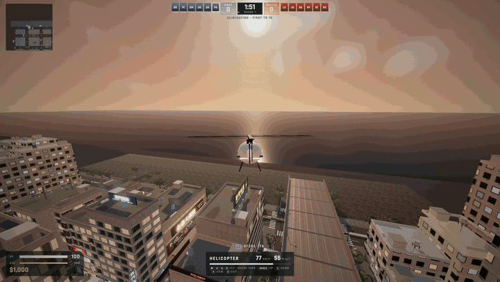
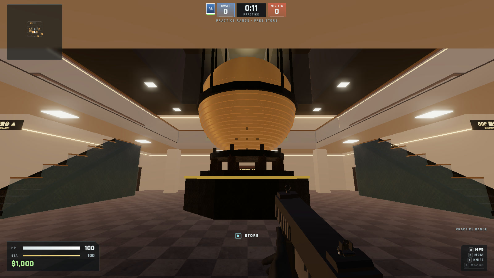
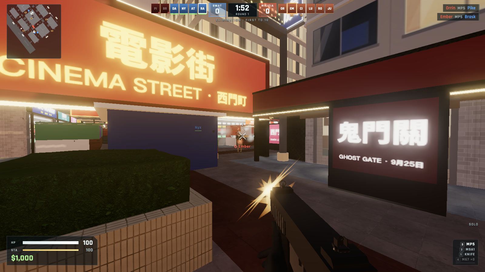
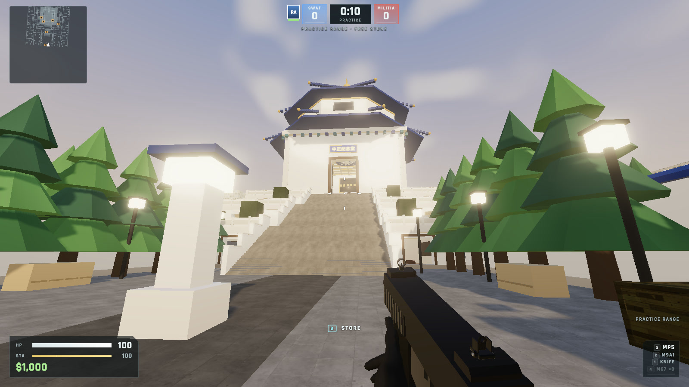
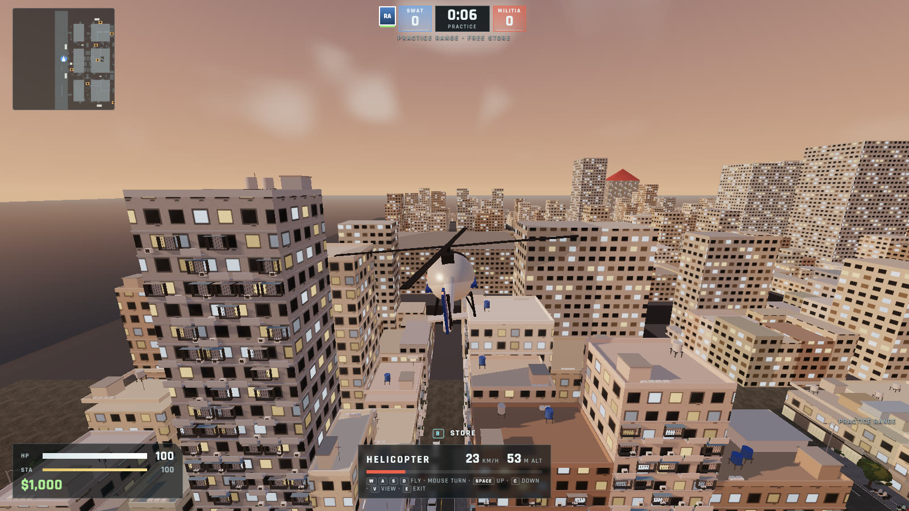
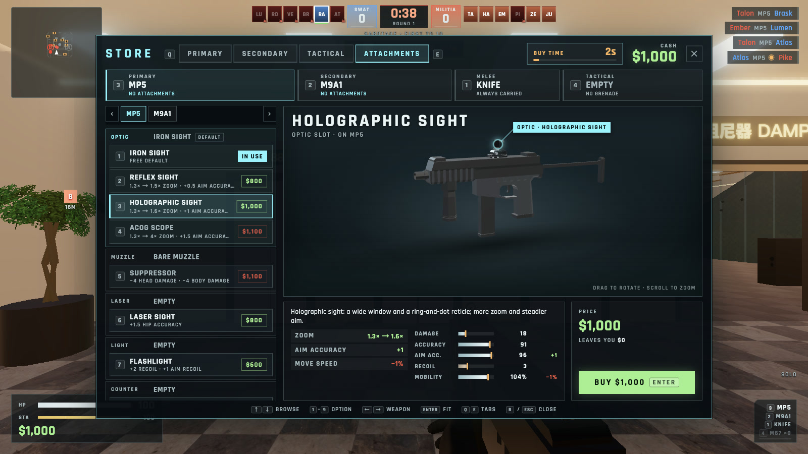
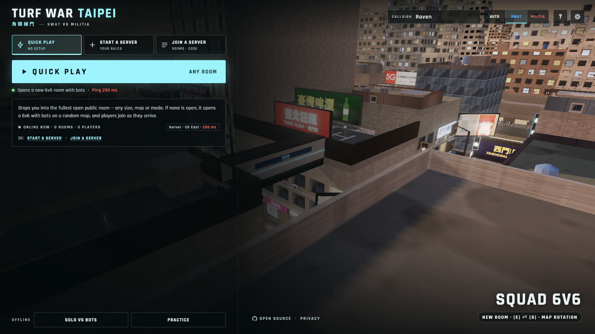
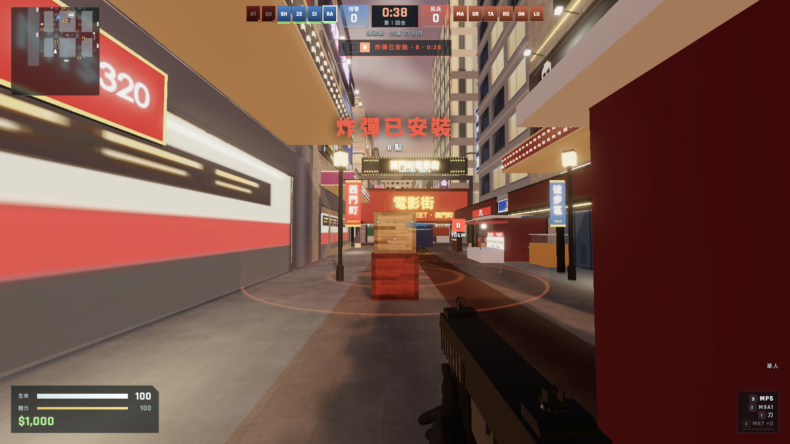

# 角頭械鬥 · Turf War: Taipei

**A round-based SWAT vs Militia shooter in the streets of Taipei, free in your browser.** Fight
through Ximending, up Taipei 101 and around the Memorial Hall, solo with bots or online, with
cash, a store and attachments in the spirit of BeGone. Nothing to install.

### [▶ Play now: turfwar.ianhsiao.me](https://turfwar.ianhsiao.me)

<!-- The GIF is a short loop from the trailer; the 30-second trailers live in public/media/ and are served by the game's site. -->
<a href="https://turfwar.ianhsiao.me/media/turfwar-trailer-30s.mp4"></a>

<sub>▶ Click the preview to watch the 30-second trailer · [中文版預告片](https://turfwar.ianhsiao.me/media/turfwar-trailer-30s.zh-TW.mp4) · files in [`public/media/`](public/media/)</sub>

## Screenshots

<table>
  <tr>
    <td width="50%"><br><sub><b>Taipei 101 · 88F</b>: the damper hall in the tower's core</sub></td>
    <td width="50%"><br><sub><b>Ximending</b>: a firefight on Cinema Street (電影街)</sub></td>
  </tr>
  <tr>
    <td><br><sub><b>Memorial Hall</b> (中正紀念堂): the grand staircase from Liberty Square</sub></td>
    <td><br><sub><b>Vehicles</b>: the helicopter over Ximending (cars and scooters too)</sub></td>
  </tr>
  <tr>
    <td><br><sub><b>Store</b>: weapons and attachments with BeGone's prices and stats</sub></td>
    <td><br><sub><b>Lobby</b>: Quick play, Start a server, Join a server</sub></td>
  </tr>
  <tr>
    <td><br><sub><b>繁體中文</b>: every screen in Traditional Chinese (炸彈已安裝)</sub></td>
    <td></td>
  </tr>
</table>

## Features

- **Two modes, short rounds, one life each.** *Elimination* (wipe out the other team) and
  *Sabotage* (Militia arms the bomb at site A or B, SWAT defends or disarms). First to 10 rounds,
  4 s freeze, 20 s buy time, no respawns inside a round.
- **Taipei maps and more.** Ximending (西門町) with its cinema street, night market and arcade; the
  Xinyi district round Taipei 101; an office floor 383 m up Taipei 101 with its tuned mass damper; the
  National Chiang Kai-shek Memorial Hall; plus homages to BeGone's maps and original battlefields:
  twelve maps in rotation. See [Gameplay → Maps](docs/GAMEPLAY.md#maps).
- **Vehicles.** Cars and taxis (with handbrake drifts), Taiwanese scooters you can shoot from one-handed,
  and a light helicopter, on the Taipei maps and Meridian District.
- **Store and attachments.** Cash for kills, headshots, assists and objectives; five primaries, two
  secondaries, a grenade and optics, suppressors, lasers, extended clips and special ammo, with BeGone's
  numbers ([weapons](docs/GAMEPLAY.md#weapons), [attachments](docs/GAMEPLAY.md#attachments-one-per-category-per-weapon-kept-for-the-match)).
- **Rooms of every size.** 1v1, 6v6 and 24v24 (big maps). *Quick play* drops you into the fullest
  public room; *Start a server* opens a public room or a private one with a 4-letter code; *Join a
  server* lists every live room with its ping. Bots fill empty slots.
- **Solo and practice.** Play offline against bots at three difficulties, or roam the practice range
  with a free store.
- **Two languages.** English and Traditional Chinese (繁體中文), switchable at any time.
- **Rebindable controls.** Every action, two keys each, physical key positions so AZERTY and Dvorak work
  ([Controls](docs/GAMEPLAY.md#controls)).
- **Phones too.** Touch controls, and the game can be installed to the home screen as an app (PWA).
- **Server-authoritative online play.** Damage, cash, purchases, rounds and the bomb run on the server
  with the same simulation as Solo; movement is client-predicted and server-validated.

## Tech stack

- **TypeScript**, **Vite** and **Three.js** in the browser (no engine, no framework).
- One **shared TypeScript simulation** (movement, collision, weapons, bots, rounds) used by Solo and
  by the server.
- **SpacetimeDB 2.10.2** for Online play: a TypeScript module with tables, reducers and a 30 Hz
  scheduled tick.
- **Bun 1.3.10** for packages and scripts, **Vitest** for tests, **Vercel** for static hosting.
- CC0 models, animations, textures and sounds, and OFL fonts (see [Assets and licences](#assets-and-licenses)).

## Quick start

You need [Bun 1.3.10](https://bun.sh). Use `bun` / `bunx`, never npm or npx.

```sh
git clone https://github.com/madeyexz/turfwar.git
cd turfwar
bun install --frozen-lockfile
bun install --cwd spacetimedb --frozen-lockfile
bun run dev        # http://localhost:5173 — Solo and Practice work right away
```

For Online play locally, install the [SpacetimeDB CLI](https://spacetimedb.com/install) (2.10.2), then
in a second terminal:

```sh
bun run dev:spacetime   # local server on :3000, publishes the module as "lawbreaker"
VITE_SPACETIMEDB_URI=same-origin VITE_SPACETIMEDB_DATABASE=lawbreaker bun run dev
```

Checks: `bun run test` (Vitest; not `bun test`), `bun run build` and `bun run typecheck:module`.

## Phone and PWA

Touch-primary devices (a coarse pointer or touch points with no mouse, iPads included) get on-screen
controls; **Settings → Controls** switches them Auto / On / Off (`?touch=1|0` for testing) and sets the
finger look speed (default 1.35×: a swipe across an iPhone SE's width turns about 180°, 230° on an
iPhone 14; aiming scales it by the zoom like the mouse). The left part of the screen is a floating stick
(it appears under the thumb; past its ring you sprint; in a vehicle it is throttle, brake and steering),
the rest is a look pad, and fire also looks while held. **Auto-aim when firing** (on by default,
`src/game/holdfire.ts`): a tap on fire shoots from the hip at once, holding it past 150 ms raises the
sights while it keeps firing, and letting go lowers them; the M110 sniper instead raises its scope while
held and fires one aimed shot on release (a quick tap fires from the hip). The knife, binoculars, a
grenade throw, a scooter rider and a toggled Aim keep the plain trigger; the Aim button still works on
its own. Buttons press the same actions as keys (`src/game/touchlayout.ts` →
`Input.touchHeld` / `touchPress`), and only those that matter are shown: Use appears near a vehicle,
crate or bomb site (hold it to arm or defuse), vehicle buttons replace the on-foot ones while seated, a
scooter rider keeps fire and the one-handed guns, and the dead get Next. Quick chat opens the keyboard
on Type. **Edit touch layout** (Settings → Controls) drags, pinches or slides to resize, hides, sets
opacity, assigns two custom slots any action, swaps to left-handed and resets; it is saved under
`lawbreaker.touch` (versioned, only the changes). Phones start on Low graphics, ask for landscape during a
match, request fullscreen on Android, and keep page scroll, zoom and long-press menus off in play.

The game installs as a web app: `public/manifest.webmanifest` (fullscreen, landscape, icons from
`bun tools/make-icons.ts`), iOS home-screen meta tags, and a service worker (`src/pwa/sw.ts`, built to
`/sw.js` with this build's file list) that fetches the page network-first, serves this build's files and
the models, textures and sounds from caches versioned by the build and by `public/`'s contents, and
never touches SpacetimeDB, its ping, PostHog or `/admin`. Phone visitors see an install hint in the
lobby (Install where the browser offers it, Share → Add to Home Screen on iOS) until they dismiss it.

## Documentation

- [CONTRIBUTING.md](CONTRIBUTING.md): the branch and pull request workflow, setup, checks and rules.
- [docs/GAMEPLAY.md](docs/GAMEPLAY.md): every mode, rule, weapon, attachment, map, vehicle and control.
- [docs/ARCHITECTURE.md](docs/ARCHITECTURE.md): multiplayer architecture and validation, performance,
  known limitations and the project layout.
- [docs/DEVELOPMENT.md](docs/DEVELOPMENT.md): running and testing locally, URL flags and check scripts,
  deploying, analytics and the admin page, and a one-minute demo script.

## Contributing

Contributions are welcome. Read [CONTRIBUTING.md](CONTRIBUTING.md) first: branch from `dev` and open
your pull request against `dev` (never `main`). Report bugs and request features through
[GitHub issues](https://github.com/madeyexz/turfwar/issues).

## Privacy

No accounts and no ads. The game stores your settings and an anonymous ID in your browser, keeps
gameplay stats on the game server and uses anonymous analytics. The full statement is the
[privacy page](https://turfwar.ianhsiao.me/privacy) ([source](privacy/index.html)).

## Assets and licenses

No proprietary game assets are used: the weapon and mode names follow BeGone, but every model,
texture, sound and line of code here is original or CC0/OFL.

- Characters, animations, props and modular kit pieces/trim sheets: free “Standard”
  editions of Quaternius' *Universal Base Characters*, *Universal Animation Library 1 & 2*,
  *Sci-Fi Essentials Kit* and *Modular Sci-Fi MegaKit* — CC0 1.0 (https://quaternius.com).
  Converted by `tools/import-assets.ts` (textures resized to WebP, animation tracks pruned and
  meshopt-compressed); see `public/assets/LICENSE.txt`.
- Weapons: models from Quaternius' *Ultimate Gun Pack* (a bayonet for the knife) — CC0 1.0
  (https://opengameart.org/content/low-poly-guns-pack). Converted from OBJ by `tools/import-guns.ts`
  (`bun tools/import-guns.ts`, with the pack extracted under `GUN_SRC`; `--preview <dir>` renders
  measured side views for placing grips, sights and muzzles) into `public/assets/guns.glb`.
- Gunshots: recordings from *The Free Firearm Sound Library* by Ben Jaszczak, Brian Nelson,
  Kevin Heras and Matthew Nanney — CC0 1.0
  (https://opengameart.org/content/the-free-firearm-sound-library). Each firearm plays two to four
  separate near-distance takes round-robin (M9A1: Walther PPQ, MP7: PPSh, MP5: Carl Gustav M45,
  M4A1: AR-15, M249: AK-47, M1014: Benelli Nova and Winchester Model 12, M110: Tikka T3 and
  Springfield 1917 .30-06), with a mid-distance take per class as the distant layer.
- Reload and handling foley, all CC0 1.0 on OpenGameArt: SpringySpringo's *Gun Reload Sounds*,
  BMacZero's *Gun Reload Sound Effects*, zer0_sol's *Handgun Reload Sound Effect* and *Shotgun
  Reload Sound Effects*, and LFA's *Equipment Clicks III*.
- `tools/fetch-sounds.ts` downloads both, cuts the takes, trims, limits, normalizes and encodes
  them to mono MP3 in `public/assets/sfx` (~570 KB); see `public/assets/sfx/LICENSE.txt`. In game
  (`src/audio.ts`) each shot layers the recording with a synthesized crack and low thump, the
  recorded action, an outdoor tail and casing bounces; remote shots are delayed by distance and
  crossfade to the distant take, and suppressed shots are muffled.
- Terrain and surface textures (including the brick, plank, corrugated-iron, plaster and
  cobblestone architecture of the BeGone maps): Poly Haven, CC0 1.0, fetched by `tools/fetch-textures.ts`; see
  `public/assets/tex/LICENSE.txt`.
- Font: Rajdhani by Indian Type Foundry, SIL Open Font License 1.1 (`public/fonts/OFL.txt`).
- Chinese font: Noto Sans TC by Google and Adobe, SIL Open Font License 1.1
  (`public/fonts/NotoSansTC-OFL.txt`), from google/fonts. `tools/subset-font.ts` (`bun tools/subset-font.ts`;
  needs `uv`, or Python with fontTools and brotli) cuts the variable font to weights 500–900 and to the
  characters the game uses (every Chinese character in `src/`, `shared/` and `index.html`, Taiwan's 4,808
  common characters from `tools/font/edu-standard-4808.txt`, CJK punctuation, Bopomofo and full-width forms):
  `public/fonts/noto-sans-tc.woff2`, about 1.4 MB and 5,084 glyphs, loaded only for Chinese text
  (`unicode-range`). `src/ui/font.test.ts` fails when the source uses a character the font lacks.
- Taipei map layout: the Ximending quarter of *臺北狂飆 / TAIPEI RUSH* (https://taipei-gta.vercel.app)
  — its streets, buildings, signs and landmarks — used with the author's permission and extracted by
  `tools/import-taipei.ts` into `shared/maps/taipei-data.ts`. Its shop names are that game's own parody
  brands. Its district meshes and atlas, street furniture, prop meshes (scooter, YouBike, trees,
  plants, signal heads) and skyline are that game's too, exported by the same tool.
- Taipei 101 · Xinyi map layout: the Xinyi district of the same game — Taipei 101's sections and
  ornaments, its plaza and mall, the Xinyi Plaza Malls, the Xinyi Skywalk, Four Four South Village, the
  streets, hills and lots — used with the author's permission and extracted by `tools/import-xinyi.ts`
  into `shared/maps/xinyi-data.ts`. Its mall and shop names are that game's own parodies. The mall's
  interior, the sunken garden and the curtain-wall detailing are this project's own.
- Taipei 101 · 88F: the tower's sections below the floor and the city's skyline and lots reuse the two
  imports above; the floor's plan, fit-out and the damper are this project's own.
- Sky, terrain, architecture, effects and the remaining audio (knife, casings, footsteps,
  explosions, heartbeat, bomb, round and cash cues, UI, and the fallback weapon voices used before
  the recordings load) are procedural.
- Engine/libraries: Three.js (MIT), Vite (MIT). The `spacetimedb` npm package declares ISC
  but ships the SpacetimeDB Business Source License 1.1 text; the SpacetimeDB server/CLI is BSL 1.1.
  Review those terms before any commercial self-hosting.

The asset tools live in `tools/` with their own `package.json`; the source packs themselves are not
committed.

## License

**License: TBD (the owner will choose).** Until a license is added, no license is granted for the
code. The third-party assets keep their own licences, CC0 and the SIL Open Font License, as listed
above.

## History

Formerly *Lawbreaker // Frontline*: the databases (`lawbreaker-dev`, `3d-game-c4lhd`), the Vercel
project and the `lawbreaker.*` browser storage keys keep the old name. The game lives at
https://turfwar.ianhsiao.me (https://lawbreaker.vercel.app still works).

## References

[BeGone wiki](https://begone.fandom.com) (rules, numbers and map layouts) · [SpacetimeDB](https://spacetimedb.com/docs/) ·
[Three.js](https://threejs.org) · [Quaternius](https://quaternius.com) · [Poly Haven](https://polyhaven.com)
